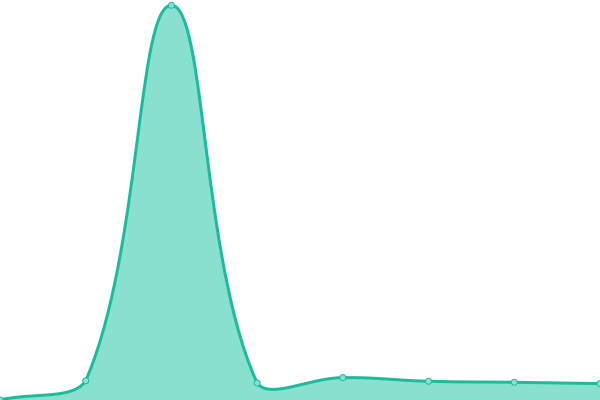

# [📈 Live Status](https://ti-or.github.io/status): <!--live status--> **🟧 Partial outage**

This repository contains the open-source uptime monitor and status page for [ti-or](https://ti-or.github.io/status), powered by [Upptime](https://github.com/upptime/upptime).

With [Upptime](https://upptime.js.org), you can get your own unlimited and free uptime monitor and status page, powered entirely by a GitHub repository. We use [Issues](https://github.com/ti-or/status/issues) as incident reports, [Actions](https://github.com/ti-or/status/actions) as uptime monitors, and [Pages](https://ti-or.github.io/status) for the status page.

<!--start: status pages-->
<!-- This summary is generated by Upptime (https://github.com/upptime/upptime) -->
<!-- Do not edit this manually, your changes will be overwritten -->
<!-- prettier-ignore -->
| URL | Status | History | Response Time | Uptime |
| --- | ------ | ------- | ------------- | ------ |
|  1PTBar | 🟩 Up | [1-pt-bar.yml](https://github.com/ti-or/status/commits/HEAD/history/1-pt-bar.yml) | 

 410ms
     
 | 

<a href="https://ti-or.github.io/status/history/1-pt-bar">98.65%</a>
    

|  52PT | 🟩 Up | [52-pt.yml](https://github.com/ti-or/status/commits/HEAD/history/52-pt.yml) | 

 583ms
     
 | 

<a href="https://ti-or.github.io/status/history/52-pt">100.00%</a>
    

|  Audiences | 🟩 Up | [audiences.yml](https://github.com/ti-or/status/commits/HEAD/history/audiences.yml) | 

 448ms
     
 | 

<a href="https://ti-or.github.io/status/history/audiences">100.00%</a>
    

|  CarPT | 🟩 Up | [car-pt.yml](https://github.com/ti-or/status/commits/HEAD/history/car-pt.yml) | 

 266ms
     
 | 

<a href="https://ti-or.github.io/status/history/car-pt">97.81%</a>
    

|  FSM | 🟩 Up | [fsm.yml](https://github.com/ti-or/status/commits/HEAD/history/fsm.yml) | 

 573ms
     
 | 

<a href="https://ti-or.github.io/status/history/fsm">100.00%</a>
    

|  GPW | 🟩 Up | [gpw.yml](https://github.com/ti-or/status/commits/HEAD/history/gpw.yml) | 

 424ms
     
 | 

<a href="https://ti-or.github.io/status/history/gpw">100.00%</a>
    

|  HDArea | 🟩 Up | [hd-area.yml](https://github.com/ti-or/status/commits/HEAD/history/hd-area.yml) | 

 545ms
     
 | 

<a href="https://ti-or.github.io/status/history/hd-area">100.00%</a>
    

|  HDATMOS | 🟩 Up | [hdatmos.yml](https://github.com/ti-or/status/commits/HEAD/history/hdatmos.yml) | 

 558ms
     
 | 

<a href="https://ti-or.github.io/status/history/hdatmos">100.00%</a>
    

|  HDChina | 🟥 Down | [hd-china.yml](https://github.com/ti-or/status/commits/HEAD/history/hd-china.yml) | 

 0ms
     
 | 

<a href="https://ti-or.github.io/status/history/hd-china">0.00%</a>
    

|  HDCity | 🟩 Up | [hd-city.yml](https://github.com/ti-or/status/commits/HEAD/history/hd-city.yml) | 

 508ms
     
 | 

<a href="https://ti-or.github.io/status/history/hd-city">89.85%</a>
    

|  HD Dolby | 🟩 Up | [hd-dolby.yml](https://github.com/ti-or/status/commits/HEAD/history/hd-dolby.yml) | 

 100ms
     
 | 

<a href="https://ti-or.github.io/status/history/hd-dolby">100.00%</a>
    

|  HDFans | 🟩 Up | [hd-fans.yml](https://github.com/ti-or/status/commits/HEAD/history/hd-fans.yml) | 

 541ms
     
 | 

<a href="https://ti-or.github.io/status/history/hd-fans">100.00%</a>
    

|  HDHome | 🟩 Up | [hd-home.yml](https://github.com/ti-or/status/commits/HEAD/history/hd-home.yml) | 

 124ms
     
 | 

<a href="https://ti-or.github.io/status/history/hd-home">100.00%</a>
    

|  HDPT | 🟩 Up | [hdpt.yml](https://github.com/ti-or/status/commits/HEAD/history/hdpt.yml) | 

 211ms
     
 | 

<a href="https://ti-or.github.io/status/history/hdpt">100.00%</a>
    

|  M-Team | 🟩 Up | [m-team.yml](https://github.com/ti-or/status/commits/HEAD/history/m-team.yml) | 

 247ms
     
 | 

<a href="https://ti-or.github.io/status/history/m-team">100.00%</a>
    

|  SSD | 🟨 Degraded | [ssd.yml](https://github.com/ti-or/status/commits/HEAD/history/ssd.yml) | 

 685ms
     
 | 

<a href="https://ti-or.github.io/status/history/ssd">99.99%</a>
    

|  ZHUQUE | 🟩 Up | [zhuque.yml](https://github.com/ti-or/status/commits/HEAD/history/zhuque.yml) | 

 582ms
     
 | 

<a href="https://ti-or.github.io/status/history/zhuque">100.00%</a>
    

|  ZmPT | 🟩 Up | [zm-pt.yml](https://github.com/ti-or/status/commits/HEAD/history/zm-pt.yml) | 

 422ms
     
 | 

<a href="https://ti-or.github.io/status/history/zm-pt">100.00%</a>
    

<!--end: status pages-->

[**Visit our status website →**](https://ti-or.github.io/status)

## 📄 License

- Powered by: [Upptime](https://github.com/upptime/upptime)
- Code: [MIT](./LICENSE) © [Anand Chowdhary](https://anandchowdhary.com), supported by [Pabio](https://pabio.com)
- Data in the `./history` directory: [Open Database License](https://opendatacommons.org/licenses/odbl/1-0/)
