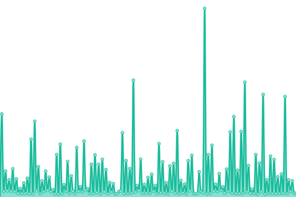
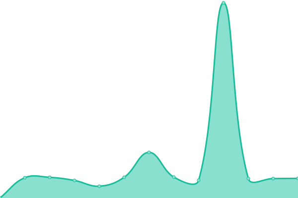

# [📈 Live Status](https://ti-or.github.io/status): <!--live status--> **🟧 部分停机**

This repository contains the open-source uptime monitor and status page for [ti-or](https://ti-or.github.io/status), powered by [Upptime](https://github.com/upptime/upptime).

With [Upptime](https://upptime.js.org), you can get your own unlimited and free uptime monitor and status page, powered entirely by a GitHub repository. We use [Issues](https://github.com/ti-or/status/issues) as incident reports, [Actions](https://github.com/ti-or/status/actions) as uptime monitors, and [Pages](https://ti-or.github.io/status) for the status page.

<!--start: status pages-->
<!-- This summary is generated by Upptime (https://github.com/upptime/upptime) -->
<!-- Do not edit this manually, your changes will be overwritten -->
<!-- prettier-ignore -->
| 链接 | 状态 | 历史 | 响应时间 | 正常运行时间 |
| --- | ------ | ------- | ------------- | ------ |
|  1PTBar | 🟥 停机 | [1-pt-bar.yml](https://github.com/ti-or/status/commits/HEAD/history/1-pt-bar.yml) | 

 74毫秒
     
 | 

<a href="https://ti-or.github.io/status/history/1-pt-bar">0.00%</a>
    

|  52PT | 🟩 正常运行 | [52-pt.yml](https://github.com/ti-or/status/commits/HEAD/history/52-pt.yml) | 

 473毫秒
     
 | 

<a href="https://ti-or.github.io/status/history/52-pt">100.00%</a>
    

|  AGSV | 🟨 运行缓慢 | [agsv.yml](https://github.com/ti-or/status/commits/HEAD/history/agsv.yml) | 

 1338毫秒
     
 | 

<a href="https://ti-or.github.io/status/history/agsv">0.00%</a>
    

|  Audiences | 🟩 正常运行 | [audiences.yml](https://github.com/ti-or/status/commits/HEAD/history/audiences.yml) | 

 438毫秒
     
 | 

<a href="https://ti-or.github.io/status/history/audiences">100.00%</a>
    

|  BTSCHOOL | 🟩 正常运行 | [btschool.yml](https://github.com/ti-or/status/commits/HEAD/history/btschool.yml) | 

 70毫秒
     
 | 

<a href="https://ti-or.github.io/status/history/btschool">100.00%</a>
    

|  CarPT | 🟩 正常运行 | [car-pt.yml](https://github.com/ti-or/status/commits/HEAD/history/car-pt.yml) | 

 214毫秒
     
 | 

<a href="https://ti-or.github.io/status/history/car-pt">100.00%</a>
    

|  CHDBits | 🟩 正常运行 | [chd-bits.yml](https://github.com/ti-or/status/commits/HEAD/history/chd-bits.yml) | 

 134毫秒
     
 | 

<a href="https://ti-or.github.io/status/history/chd-bits">100.00%</a>
    

|  CrabPT | 🟩 正常运行 | [crab-pt.yml](https://github.com/ti-or/status/commits/HEAD/history/crab-pt.yml) | 

 465毫秒
     
 | 

<a href="https://ti-or.github.io/status/history/crab-pt">94.73%</a>
    

|  CyanBug | 🟩 正常运行 | [cyan-bug.yml](https://github.com/ti-or/status/commits/HEAD/history/cyan-bug.yml) | 

 1488毫秒
     
 | 

<a href="https://ti-or.github.io/status/history/cyan-bug">97.60%</a>
    

|  DIC | 🟩 正常运行 | [dic.yml](https://github.com/ti-or/status/commits/HEAD/history/dic.yml) | 

 712毫秒
     
 | 

<a href="https://ti-or.github.io/status/history/dic">100.00%</a>
    

|  DiscFan | 🟩 正常运行 | [disc-fan.yml](https://github.com/ti-or/status/commits/HEAD/history/disc-fan.yml) | 

 612毫秒
     
 | 

<a href="https://ti-or.github.io/status/history/disc-fan">100.00%</a>
    

|  FSM | 🟩 正常运行 | [fsm.yml](https://github.com/ti-or/status/commits/HEAD/history/fsm.yml) | 

 557毫秒
     
 | 

<a href="https://ti-or.github.io/status/history/fsm">100.00%</a>
    

|  GGPT | 🟩 正常运行 | [ggpt.yml](https://github.com/ti-or/status/commits/HEAD/history/ggpt.yml) | 

 954毫秒
     
 | 

<a href="https://ti-or.github.io/status/history/ggpt">96.87%</a>
    

|  GPW | 🟩 正常运行 | [gpw.yml](https://github.com/ti-or/status/commits/HEAD/history/gpw.yml) | 

 922毫秒
     
 | 

<a href="https://ti-or.github.io/status/history/gpw">100.00%</a>
    

|  HaresClub | 🟩 正常运行 | [hares-club.yml](https://github.com/ti-or/status/commits/HEAD/history/hares-club.yml) | 

 830毫秒
     
 | 

<a href="https://ti-or.github.io/status/history/hares-club">100.00%</a>
    

|  HD Dolby | 🟩 正常运行 | [hd-dolby.yml](https://github.com/ti-or/status/commits/HEAD/history/hd-dolby.yml) | 

 105毫秒
     
 | 

<a href="https://ti-or.github.io/status/history/hd-dolby">100.00%</a>
    

|  HD4FANS | 🟩 正常运行 | [hd-4-fans.yml](https://github.com/ti-or/status/commits/HEAD/history/hd-4-fans.yml) | 

 534毫秒
     
 | 

<a href="https://ti-or.github.io/status/history/hd-4-fans">100.00%</a>
    

|  HDATMOS | 🟩 正常运行 | [hdatmos.yml](https://github.com/ti-or/status/commits/HEAD/history/hdatmos.yml) | 

 600毫秒
     
 | 

<a href="https://ti-or.github.io/status/history/hdatmos">100.00%</a>
    

|  HDCity | 🟩 正常运行 | [hd-city.yml](https://github.com/ti-or/status/commits/HEAD/history/hd-city.yml) | 

 865毫秒
     
 | 

<a href="https://ti-or.github.io/status/history/hd-city">100.00%</a>
    

|  HDHome | 🟩 正常运行 | [hd-home.yml](https://github.com/ti-or/status/commits/HEAD/history/hd-home.yml) | 

 178毫秒
     
 | 

<a href="https://ti-or.github.io/status/history/hd-home">100.00%</a>
    

|  HDFans | 🟩 正常运行 | [hd-fans.yml](https://github.com/ti-or/status/commits/HEAD/history/hd-fans.yml) | 

 567毫秒
     
 | 

<a href="https://ti-or.github.io/status/history/hd-fans">100.00%</a>
    

|  HDKylin | 🟥 停机 | [hd-kylin.yml](https://github.com/ti-or/status/commits/HEAD/history/hd-kylin.yml) | 

 563毫秒
     
 | 

<a href="https://ti-or.github.io/status/history/hd-kylin">0.00%</a>
    

|  HDSky | 🟩 正常运行 | [hd-sky.yml](https://github.com/ti-or/status/commits/HEAD/history/hd-sky.yml) | 

 700毫秒
     
 | 

<a href="https://ti-or.github.io/status/history/hd-sky">99.79%</a>
    

|  HDPOST | 🟩 正常运行 | [hdpost.yml](https://github.com/ti-or/status/commits/HEAD/history/hdpost.yml) | 

 397毫秒
     
 | 

<a href="https://ti-or.github.io/status/history/hdpost">89.03%</a>
    

|  M-Team | 🟩 正常运行 | [m-team.yml](https://github.com/ti-or/status/commits/HEAD/history/m-team.yml) | 

 372毫秒
     
 | 

<a href="https://ti-or.github.io/status/history/m-team">100.00%</a>
    

|  PT@KEEPFRDS | 🟩 正常运行 | [pt-keepfrds.yml](https://github.com/ti-or/status/commits/HEAD/history/pt-keepfrds.yml) | 

 1780毫秒
     
 | 

<a href="https://ti-or.github.io/status/history/pt-keepfrds">95.31%</a>
    

|  PTChina | 🟩 正常运行 | [pt-china.yml](https://github.com/ti-or/status/commits/HEAD/history/pt-china.yml) | 

 468毫秒
     
 | 

<a href="https://ti-or.github.io/status/history/pt-china">90.25%</a>
    

|  PTer | 🟩 正常运行 | [p-ter.yml](https://github.com/ti-or/status/commits/HEAD/history/p-ter.yml) | 

 1402毫秒
     
 | 

<a href="https://ti-or.github.io/status/history/p-ter">92.27%</a>
    

|  pttime | 🟩 正常运行 | [pttime.yml](https://github.com/ti-or/status/commits/HEAD/history/pttime.yml) | 

 200毫秒
     
 | 

<a href="https://ti-or.github.io/status/history/pttime">100.00%</a>
    

|  Rousi | 🟩 正常运行 | [rousi.yml](https://github.com/ti-or/status/commits/HEAD/history/rousi.yml) | 

 641毫秒
     
 | 

<a href="https://ti-or.github.io/status/history/rousi">98.39%</a>
    

|  SSD | 🟩 正常运行 | [ssd.yml](https://github.com/ti-or/status/commits/HEAD/history/ssd.yml) | 

 412毫秒
     
 | 

<a href="https://ti-or.github.io/status/history/ssd">100.00%</a>
    

|  ToSky | 🟩 正常运行 | [to-sky.yml](https://github.com/ti-or/status/commits/HEAD/history/to-sky.yml) | 

 505毫秒
     
 | 

<a href="https://ti-or.github.io/status/history/to-sky">100.00%</a>
    

|  UltraHD | 🟩 正常运行 | [ultra-hd.yml](https://github.com/ti-or/status/commits/HEAD/history/ultra-hd.yml) | 

 349毫秒
     
 | 

<a href="https://ti-or.github.io/status/history/ultra-hd">100.00%</a>
    

|  U2 | 🟩 正常运行 | [u2.yml](https://github.com/ti-or/status/commits/HEAD/history/u2.yml) | 

 796毫秒
     
 | 

<a href="https://ti-or.github.io/status/history/u2">100.00%</a>
    

|  UBits | 🟩 正常运行 | [u-bits.yml](https://github.com/ti-or/status/commits/HEAD/history/u-bits.yml) | 

 74毫秒
     
 | 

<a href="https://ti-or.github.io/status/history/u-bits">100.00%</a>
    

|  wintersakura | 🟩 正常运行 | [wintersakura.yml](https://github.com/ti-or/status/commits/HEAD/history/wintersakura.yml) | 

 361毫秒
     
 | 

<a href="https://ti-or.github.io/status/history/wintersakura">100.00%</a>
    

|  xingtan | 🟩 正常运行 | [xingtan.yml](https://github.com/ti-or/status/commits/HEAD/history/xingtan.yml) | 

 3793毫秒
     
 | 

<a href="https://ti-or.github.io/status/history/xingtan">96.46%</a>
    

|  ZHUQUE | 🟩 正常运行 | [zhuque.yml](https://github.com/ti-or/status/commits/HEAD/history/zhuque.yml) | 

 583毫秒
     
 | 

<a href="https://ti-or.github.io/status/history/zhuque">100.00%</a>
    

|  ZmPT | 🟩 正常运行 | [zm-pt.yml](https://github.com/ti-or/status/commits/HEAD/history/zm-pt.yml) | 

 545毫秒
     
 | 

<a href="https://ti-or.github.io/status/history/zm-pt">100.00%</a>
    

<!--end: status pages-->

[**Visit our status website →**](https://ti-or.github.io/status)

## 📄 License

- Powered by: [Upptime](https://github.com/upptime/upptime)
- Code: [MIT](./LICENSE) © [Anand Chowdhary](https://anandchowdhary.com), supported by [Pabio](https://pabio.com)
- Data in the `./history` directory: [Open Database License](https://opendatacommons.org/licenses/odbl/1-0/)
