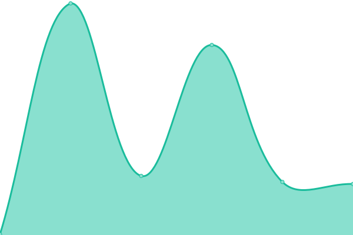
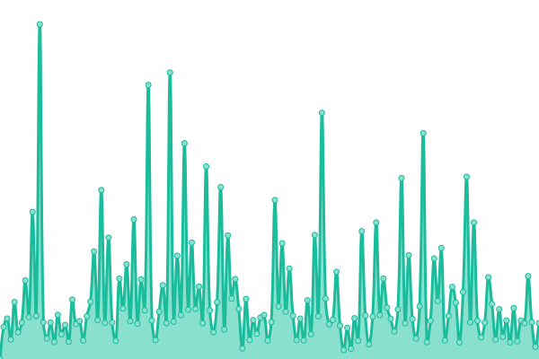

# [📈 Live Status](https://ti-or.github.io/status): <!--live status--> **🟧 Partial outage**

This repository contains the open-source uptime monitor and status page for [ti-or](https://ti-or.github.io/status), powered by [Upptime](https://github.com/upptime/upptime).

With [Upptime](https://upptime.js.org), you can get your own unlimited and free uptime monitor and status page, powered entirely by a GitHub repository. We use [Issues](https://github.com/ti-or/status/issues) as incident reports, [Actions](https://github.com/ti-or/status/actions) as uptime monitors, and [Pages](https://ti-or.github.io/status) for the status page.

<!--start: status pages-->
<!-- This summary is generated by Upptime (https://github.com/upptime/upptime) -->
<!-- Do not edit this manually, your changes will be overwritten -->
<!-- prettier-ignore -->
| URL | Status | History | Response Time | Uptime |
| --- | ------ | ------- | ------------- | ------ |
|  1PTBar | 🟥 Down | [1-pt-bar.yml](https://github.com/ti-or/status/commits/HEAD/history/1-pt-bar.yml) | 

 293ms
     
 | 

<a href="https://ti-or.github.io/status/history/1-pt-bar">58.64%</a>
    

|  52PT | 🟩 Up | [52-pt.yml](https://github.com/ti-or/status/commits/HEAD/history/52-pt.yml) | 

 607ms
     
 | 

<a href="https://ti-or.github.io/status/history/52-pt">100.00%</a>
    

|  AGSV | 🟨 Degraded | [agsv.yml](https://github.com/ti-or/status/commits/HEAD/history/agsv.yml) | 

 1549ms
     
 | 

<a href="https://ti-or.github.io/status/history/agsv">0.00%</a>
    

|  Audiences | 🟩 Up | [audiences.yml](https://github.com/ti-or/status/commits/HEAD/history/audiences.yml) | 

 482ms
     
 | 

<a href="https://ti-or.github.io/status/history/audiences">100.00%</a>
    

|  BTSCHOOL | 🟩 Up | [btschool.yml](https://github.com/ti-or/status/commits/HEAD/history/btschool.yml) | 

 80ms
     
 | 

<a href="https://ti-or.github.io/status/history/btschool">98.97%</a>
    

|  CarPT | 🟩 Up | [car-pt.yml](https://github.com/ti-or/status/commits/HEAD/history/car-pt.yml) | 

 335ms
     
 | 

<a href="https://ti-or.github.io/status/history/car-pt">96.88%</a>
    

|  CHDBits | 🟩 Up | [chd-bits.yml](https://github.com/ti-or/status/commits/HEAD/history/chd-bits.yml) | 

 126ms
     
 | 

<a href="https://ti-or.github.io/status/history/chd-bits">98.97%</a>
    

|  CrabPT | 🟩 Up | [crab-pt.yml](https://github.com/ti-or/status/commits/HEAD/history/crab-pt.yml) | 

 393ms
     
 | 

<a href="https://ti-or.github.io/status/history/crab-pt">95.87%</a>
    

|  CyanBug | 🟩 Up | [cyan-bug.yml](https://github.com/ti-or/status/commits/HEAD/history/cyan-bug.yml) | 

 1288ms
     
 | 

<a href="https://ti-or.github.io/status/history/cyan-bug">78.45%</a>
    

|  DIC | 🟩 Up | [dic.yml](https://github.com/ti-or/status/commits/HEAD/history/dic.yml) | 

 679ms
     
 | 

<a href="https://ti-or.github.io/status/history/dic">100.00%</a>
    

|  DiscFan | 🟩 Up | [disc-fan.yml](https://github.com/ti-or/status/commits/HEAD/history/disc-fan.yml) | 

 572ms
     
 | 

<a href="https://ti-or.github.io/status/history/disc-fan">100.00%</a>
    

|  FSM | 🟩 Up | [fsm.yml](https://github.com/ti-or/status/commits/HEAD/history/fsm.yml) | 

 565ms
     
 | 

<a href="https://ti-or.github.io/status/history/fsm">100.00%</a>
    

|  GGPT | 🟩 Up | [ggpt.yml](https://github.com/ti-or/status/commits/HEAD/history/ggpt.yml) | 

 790ms
     
 | 

<a href="https://ti-or.github.io/status/history/ggpt">100.00%</a>
    

|  GPW | 🟩 Up | [gpw.yml](https://github.com/ti-or/status/commits/HEAD/history/gpw.yml) | 

 545ms
     
 | 

<a href="https://ti-or.github.io/status/history/gpw">100.00%</a>
    

|  HaresClub | 🟩 Up | [hares-club.yml](https://github.com/ti-or/status/commits/HEAD/history/hares-club.yml) | 

 816ms
     
 | 

<a href="https://ti-or.github.io/status/history/hares-club">100.00%</a>
    

|  HD Dolby | 🟩 Up | [hd-dolby.yml](https://github.com/ti-or/status/commits/HEAD/history/hd-dolby.yml) | 

 105ms
     
 | 

<a href="https://ti-or.github.io/status/history/hd-dolby">100.00%</a>
    

|  HD4FANS | 🟥 Down | [hd-4-fans.yml](https://github.com/ti-or/status/commits/HEAD/history/hd-4-fans.yml) | 

 1018ms
     
 | 

<a href="https://ti-or.github.io/status/history/hd-4-fans">0.00%</a>
    

|  HDATMOS | 🟩 Up | [hdatmos.yml](https://github.com/ti-or/status/commits/HEAD/history/hdatmos.yml) | 

 540ms
     
 | 

<a href="https://ti-or.github.io/status/history/hdatmos">100.00%</a>
    

|  HDCity | 🟩 Up | [hd-city.yml](https://github.com/ti-or/status/commits/HEAD/history/hd-city.yml) | 

 683ms
     
 | 

<a href="https://ti-or.github.io/status/history/hd-city">98.19%</a>
    

|  HDHome | 🟩 Up | [hd-home.yml](https://github.com/ti-or/status/commits/HEAD/history/hd-home.yml) | 

 178ms
     
 | 

<a href="https://ti-or.github.io/status/history/hd-home">100.00%</a>
    

|  HDFans | 🟩 Up | [hd-fans.yml](https://github.com/ti-or/status/commits/HEAD/history/hd-fans.yml) | 

 550ms
     
 | 

<a href="https://ti-or.github.io/status/history/hd-fans">100.00%</a>
    

|  HDKylin | 🟩 Up | [hd-kylin.yml](https://github.com/ti-or/status/commits/HEAD/history/hd-kylin.yml) | 

 825ms
     
 | 

<a href="https://ti-or.github.io/status/history/hd-kylin">1.04%</a>
    

|  HDSky | 🟩 Up | [hd-sky.yml](https://github.com/ti-or/status/commits/HEAD/history/hd-sky.yml) | 

 452ms
     
 | 

<a href="https://ti-or.github.io/status/history/hd-sky">99.11%</a>
    

|  HDPOST | 🟩 Up | [hdpost.yml](https://github.com/ti-or/status/commits/HEAD/history/hdpost.yml) | 

 460ms
     
 | 

<a href="https://ti-or.github.io/status/history/hdpost">100.00%</a>
    

|  M-Team | 🟩 Up | [m-team.yml](https://github.com/ti-or/status/commits/HEAD/history/m-team.yml) | 

 285ms
     
 | 

<a href="https://ti-or.github.io/status/history/m-team">100.00%</a>
    

|  PT@KEEPFRDS | 🟩 Up | [pt-keepfrds.yml](https://github.com/ti-or/status/commits/HEAD/history/pt-keepfrds.yml) | 

 1407ms
     
 | 

<a href="https://ti-or.github.io/status/history/pt-keepfrds">90.28%</a>
    

|  PTChina | 🟥 Down | [pt-china.yml](https://github.com/ti-or/status/commits/HEAD/history/pt-china.yml) | 

 0ms
     
 | 

<a href="https://ti-or.github.io/status/history/pt-china">0.03%</a>
    

|  PTer | 🟨 Degraded | [p-ter.yml](https://github.com/ti-or/status/commits/HEAD/history/p-ter.yml) | 

 1043ms
     
 | 

<a href="https://ti-or.github.io/status/history/p-ter">97.92%</a>
    

|  pttime | 🟩 Up | [pttime.yml](https://github.com/ti-or/status/commits/HEAD/history/pttime.yml) | 

 202ms
     
 | 

<a href="https://ti-or.github.io/status/history/pttime">46.96%</a>
    

|  Rousi | 🟩 Up | [rousi.yml](https://github.com/ti-or/status/commits/HEAD/history/rousi.yml) | 

 334ms
     
 | 

<a href="https://ti-or.github.io/status/history/rousi">96.98%</a>
    

|  SSD | 🟩 Up | [ssd.yml](https://github.com/ti-or/status/commits/HEAD/history/ssd.yml) | 

 557ms
     
 | 

<a href="https://ti-or.github.io/status/history/ssd">99.38%</a>
    

|  ToSky | 🟩 Up | [to-sky.yml](https://github.com/ti-or/status/commits/HEAD/history/to-sky.yml) | 

 674ms
     
 | 

<a href="https://ti-or.github.io/status/history/to-sky">100.00%</a>
    

|  UltraHD | 🟩 Up | [ultra-hd.yml](https://github.com/ti-or/status/commits/HEAD/history/ultra-hd.yml) | 

 301ms
     
 | 

<a href="https://ti-or.github.io/status/history/ultra-hd">100.00%</a>
    

|  U2 | 🟩 Up | [u2.yml](https://github.com/ti-or/status/commits/HEAD/history/u2.yml) | 

 650ms
     
 | 

<a href="https://ti-or.github.io/status/history/u2">100.00%</a>
    

|  UBits | 🟥 Down | [u-bits.yml](https://github.com/ti-or/status/commits/HEAD/history/u-bits.yml) | 

 419ms
     
 | 

<a href="https://ti-or.github.io/status/history/u-bits">89.87%</a>
    

|  wintersakura | 🟩 Up | [wintersakura.yml](https://github.com/ti-or/status/commits/HEAD/history/wintersakura.yml) | 

 441ms
     
 | 

<a href="https://ti-or.github.io/status/history/wintersakura">100.00%</a>
    

|  xingtan | 🟩 Up | [xingtan.yml](https://github.com/ti-or/status/commits/HEAD/history/xingtan.yml) | 

 614ms
     
 | 

<a href="https://ti-or.github.io/status/history/xingtan">100.00%</a>
    

|  ZHUQUE | 🟩 Up | [zhuque.yml](https://github.com/ti-or/status/commits/HEAD/history/zhuque.yml) | 

 596ms
     
 | 

<a href="https://ti-or.github.io/status/history/zhuque">100.00%</a>
    

|  ZmPT | 🟩 Up | [zm-pt.yml](https://github.com/ti-or/status/commits/HEAD/history/zm-pt.yml) | 

 419ms
     
 | 

<a href="https://ti-or.github.io/status/history/zm-pt">100.00%</a>
    

<!--end: status pages-->

[**Visit our status website →**](https://ti-or.github.io/status)

## 📄 License

- Powered by: [Upptime](https://github.com/upptime/upptime)
- Code: [MIT](./LICENSE) © [Anand Chowdhary](https://anandchowdhary.com), supported by [Pabio](https://pabio.com)
- Data in the `./history` directory: [Open Database License](https://opendatacommons.org/licenses/odbl/1-0/)
